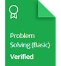

<h1 align="center">Hi 👋, I'm Raj Gupta</h1>
<h3 align="center">I'm a Programming enthusiast and Web developer having affinity towards Software development. Currently, I am pursuing B.Tech in Computer Science from Medi-Caps University.</h3>

  

<h3 align="left">Connect with me:</h3>

<h3 align="left">Languages and Tools:</h3>

                    

&nbsp;

## HackerRank Certificates

